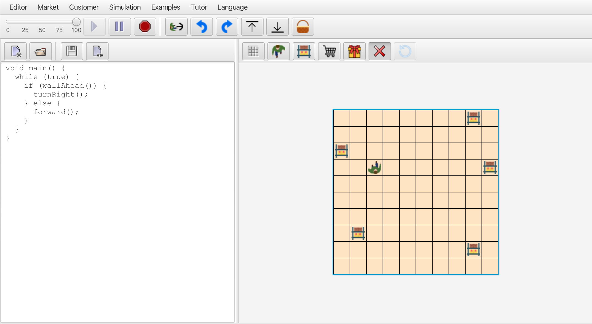

# Mini-Programming-World

## Description

In this mini-programming-world a customer should be guided through a supermarket, solving problems
in the process. The customer is controlled by a small set of simple instructions. With this program,
the user should be able to learn simple programming concepts.



### Landscape

The landscape the actor can move around in, is a 2-dimensional overview of a supermarket, separated
into single tiles. The structure of the supermarket can vary from each exercise. Additionally, the
supermarket is surrounded by walls and cannot be exited.
There can be a shelf on a tile. A tile with a shelf cannot be entered and no other object can be on
the same tile as the shelf.
Furthermore, a shopping cart can be on a tile. The customer can move the shopping cart by walking
into it if the next tile is not occupied by a shelf or another cart.
Finally, there can be a single present on a tile. A present is small, and therefore it can share the
tile with a shopping cart. The customer can pick up the present if he stands on the same tile.

### Actor

The customer who wants to buy presents in a supermarket. The customer is always on a tile in the
supermarket and looks in one of the four directions.

The customer can interact with the environment by pushing shopping carts and picking up presents
into his basket.

### Commands

| **Command**             | **Description**                                                                                  |
|-------------------------|--------------------------------------------------------------------------------------------------|
| `void forward()`        | The customer walks a tile forwards. This will push away a shopping cart, if one is on that tile. |
| `void turnLeft()`       | The customer turns 90° left.                                                                     |
| `void turnRight()`      | The customer turns 90° right.                                                                    |
| `void pickUp()`         | The customer picks up a present on the current tile and puts it in his basket.                   |
| `void putDown()`        | The customer takes a present out of his basket and puts it onto the ground.                      |
| `boolean wallAhead()`   | Checks whether there is a wall on the tile in front of the actor.                                |
| `boolean cartAhead()`   | Checks whether there is a cart on the tile in front of the actor.                                |
| `boolean pushable()`    | Checks whether the cart in front of the customer can be pushed one tile.                         |
| `boolean presentHere()` | Checks whether there is a present at the current location.                                       |
| `boolean basketEmpty()` | Checks whether the customer's basket is empty.                                                   |

## Running the project

This project requires Java 21 and maven to be run. 

```sh
mvn package
java -cp target/MPWSimulator.jar EntryPoint
```

## Icon sources

- Shopping Cart: made by [Freepik](https://www.freepik.com)
  from [Flaticon](https://www.flaticon.com/)
- Shelf: made by [Freepik](https://www.freepik.com) from [Flaticon](https://www.flaticon.com/)
- Basket: made by [Freepik](https://www.freepik.com) from [Flaticon](https://www.flaticon.com/)
- Turn Left/ Turn Right: made by [Iconpro86](https://www.flaticon.com/authors/iconpro86)
  from [Flaticon](https://www.flaticon.com/)
- Reset: made by [Andrean Prabowo](https://www.flaticon.com/authors/andrean-prabowo)
  from [Flaticon](https://www.flaticon.com/)
